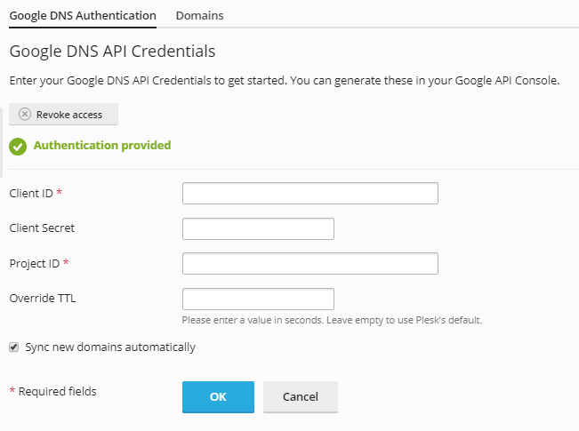
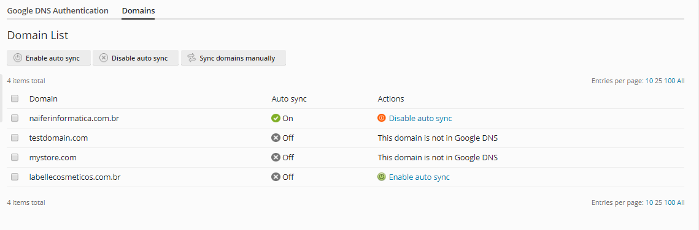

[Support me with any value](https://www.paypal.com/cgi-bin/webscr?cmd=_donations&business=GXSHAPXEWM8QU&currency_code=USD)

# Google DNS Extension for Plesk 18.0.26+





## Requirements
- PHP 7.1+ 
- Plesk 18.0.26 or higher
- One or more domains hosted with Google DNS and API access

## How to install

- Navigate to the releases tab: https://github.com/spacedog4/plesk-googledns/releases/latest
- Download the extension
- Add the following to your [panel.ini](https://docs.plesk.com/en-US/onyx/administrator-guide/plesk-administration/panelini-configuration-file.78509/) file:

    ```
    [ext-catalog]
    
    extensionUpload = true
    ```
    This makes sure that you can upload extension on the extension page.
- Navigate to the `Extensions` page, then `My Extensions`. Here you can upload the extension zip.
- Google DNS should now be visible in your extension list.

## How to configure

You need o active Cloud DNS API on Google API Console
- Go to [Google Api Console](https://console.developers.google.com/apis/dashboard)
- Choose your project
- Search for "DNS" and select ["Cloud DNS API"](https://console.developers.google.com/apis/library/dns.googleapis.com)
- Active "Cloud DNS API", you may need to enable billing

If you are using a domain in plesk instead of the IP Address, you must add it to the [authorized domains list](https://console.developers.google.com/apis/credentials/consent)
- Go to [Google Api Console](https://console.developers.google.com/apis/dashboard)
- Choose your project
- On the left menu, go to [OAuth consent screen](https://console.developers.google.com/apis/credentials/consent)
- Choose External
- Scroll to "Authorized domains" and add your domain without any http/https or path. Ex.: my-plesk-domain.com
- Press Enter
- Save it

You have to create a OAuth 2.0 credential on Google API Console
- Go to [Google Api Console](https://console.developers.google.com/apis/dashboard)
- Choose your project
- On the left menu, go to [Credentials](https://console.developers.google.com/apis/credentials)
- Click on "Create Credentials" 
- Click on "OAuth client ID"
- Choose "Web Application"
- Inside "Authorized redirect URIs" add your plesk domain/ip followed by */modules/googledns/index.php/index/authenticate*. Ex.: https://my-plesk-domain.com/modules/googledns/index.php/index/authenticate
- Save "Your Client ID" and "Your Client Secret" to set it on plesk extension later

## How to build

Install the dependencies first with composer. Unlike a regular composer package the `vendor` folder
can be found in the subdirectory `src/plib`. This is the folder that eventually ends up on Plesk.  
This is what an extension's file structure should
look like: https://docs.plesk.com/en-US/onyx/extensions-guide/plesk-extensions-basics/extension-structure.71076/


